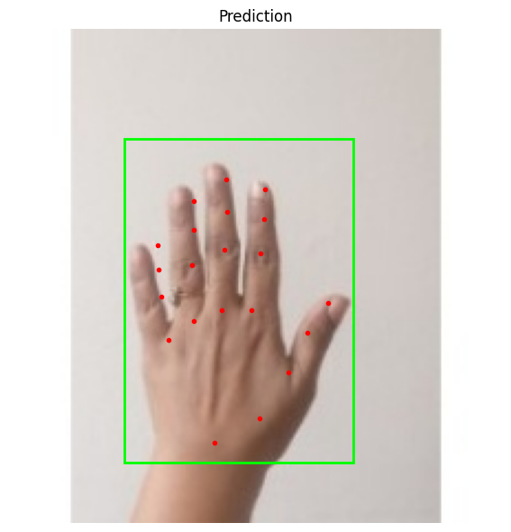
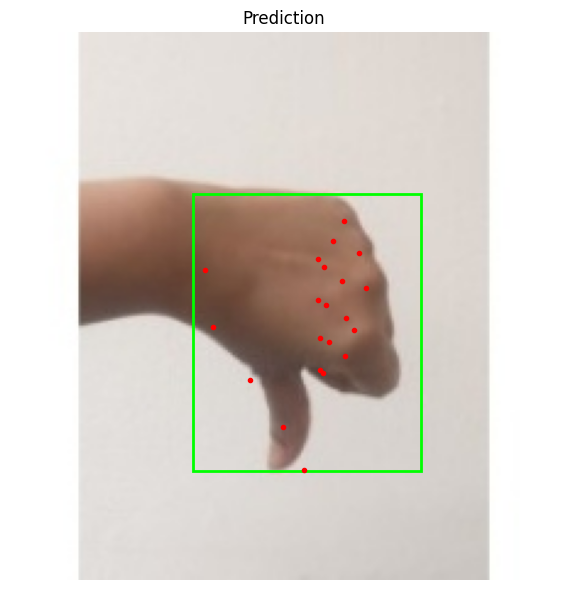
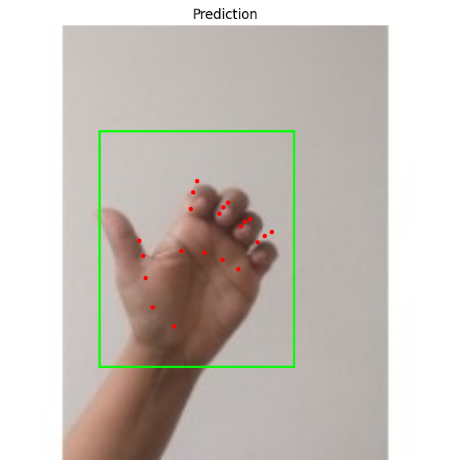
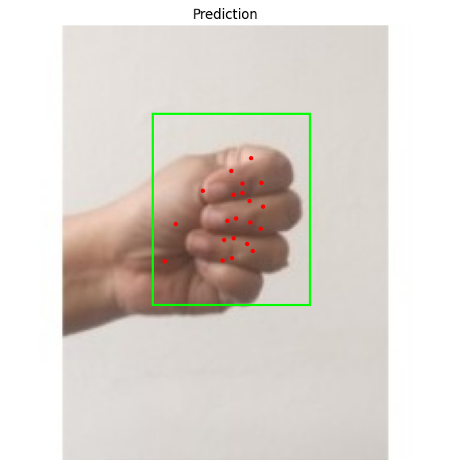

Для тренировки взяты данные из датасета ultralytics. Это фото 224*224 рук в различных позициях на белом фоне.
Можно скачать по [ссылке](https://github.com/ultralytics/assets/releases/download/v0.0.0/hand-keypoints.zip).


Была натренирована кастомная модель, в основе которой лежит resnet18-архитектура с регрессионной головой с выходной размерностью 21 (keypoints)*2 + 4 (bbox) = **46**. Модель была обучена только на этом датасете (pretrained=False) на протяжении 30 эпох. Примеры полученных результатов на валидационных картинках:






Но в самом приложении модель показывала себя плохо, поэтому мы также попробовали взять претренированный resnet и дообучить классификационную голову (5-10 эпох).
Результат на видео получился несколько лучше, чем при тренировке с нуля.


Приложение можно запустить из корня репозитория: 

```
python src\hw_7\app_updated.py --use-mymodel
```