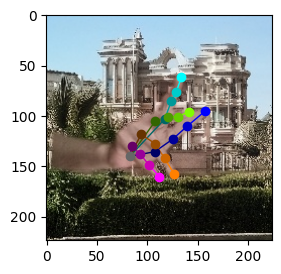
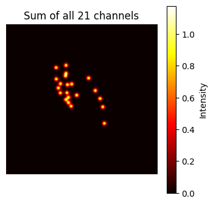
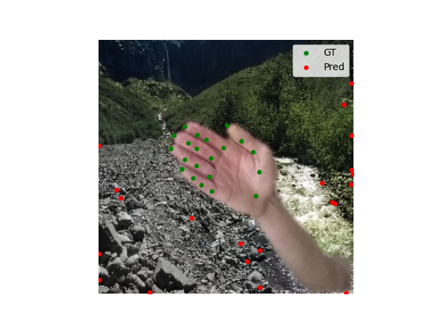
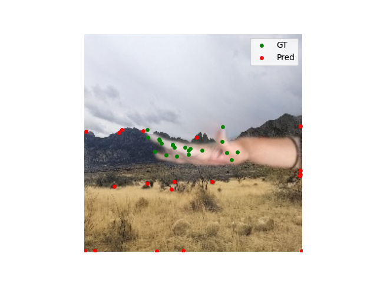
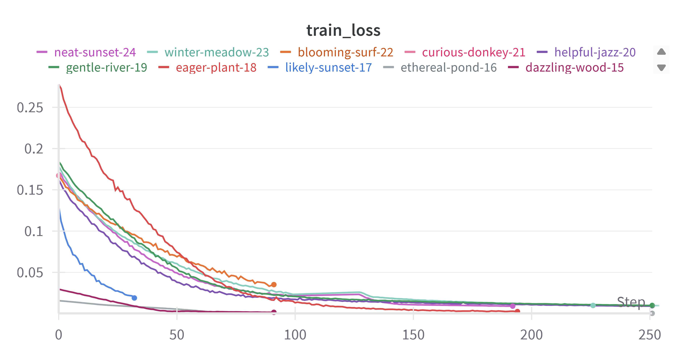

# Hand Joint Estimation with U-Net-like Models
## Цель
Натренировать модель U-Net-подобной архитектуры для задачи предсказания суставов руки по изображениям из датасета FreiHAND. Модель обучалась предсказывать heatmap'ы суставов.

**Датасет**

Все эксперименты проводились на датасете FreiHAND. Этот набор предоставляет:

- RGB-изображения руки

- Калибровочную матрицу камеры

- 3D и 2D координаты 21 сустава

- Сегментационные маски руки

Мы использовали только 2D-проекции суставов (joints_uv), а точнее их маски, полученные с помощью гауссиан, как целевые значения для обучения.

Пайплайн был следующий:
- перевод из 3D координат в 2D проекцию с помощью intrinsics матрицы
- построение хитмапов joint-ов (Гауссианы)
- предсказание с помощью UNet-like модели
- подсчет MSE (либо BCE, см. эксперименты) лосса между хитмапами
- расчет координат с помощью argmax

## Эксперименты
Мы провели серию экспериментов, в которых варьировали следующие параметры:

- Количество выходных heatmap-ов:

21 — по одному на каждый сустав
1 — только указательный палец (для упрощения)

- Функция потерь:

MSELoss

BCELoss — бинарная кросс-энтропия по логитам от heatmap'ов

- Глубина сети:

Изменяли количество downsampling-этапов в U-Net. Пробовали и "мелкие", и "глубокие" архитектуры

- Результаты
Несмотря на разнообразие конфигураций, ни одна из моделей не достигла хорошего качества предсказания суставов:

Предсказания зачастую:

- сбивались в одну точку в центре изображения
- или попадали на резкие границы объектов (видимо, реагируя на контраст)

Траектории суставов не соответствовали действительной позе руки

Примеры графиков лосса (см. ниже) показывают, что лосс довольно быстро падает, но обучение приводит к плохим минимумам.

- Почему не удалось сравнить с SOTA

Визуальное качество наших предсказаний было недостаточным, координаты суставов не имели смысла → сравнение некорректно

## Вывод
Мы попытались заставить простую модель U-Net работать для задачи heatmap-базированной оценки позы руки:

Протестированы разные лоссы, архитектуры, количества выходов

Использовался надежный датасет с ground truth

Однако:

- Ни один из вариантов не дал адекватных результатов.

Это подчеркивает важность более эффективной предобработки данных и использования сегментации или детекции как предварительного этапа, а также учета геометрии руки.
